# Demostracion 01: Creación y prueba de un flujo con Amazon Bedrock Flows

## Objetivo de la práctica

Al finalizar la práctica, serás capaz de:

- Crear un flujo básico utilizando **Amazon Bedrock Flows**.
- Identificar los principales componentes de un Flow.
- Configurar un **foundation model** dentro de un flujo.
- Ejecutar y validar el funcionamiento de un workflow desde AWS Management Console.
- Revisar el **rastro de ejecución** para identificar los nodos que participaron en el procesamiento.
- Relacionar el uso de workflows con la construcción de soluciones de **IA agéntica**.

---

## Objetivo Visual


### Relación con IA agéntica

Amazon Bedrock Flows permite comprender cómo se estructuran y coordinan diferentes pasos dentro de una aplicación de IA.

En este laboratorio se trabaja con un workflow sencillo y predefinido. Este tipo de flujo constituye una base para comprender soluciones de IA agéntica más avanzadas, donde los agentes pueden incorporar capacidades adicionales como:

- Razonamiento.
- Planificación.
- Memoria.
- Uso de herramientas.
- Toma de decisiones.
- Adaptación según los resultados obtenidos.

> **Nota:** El Flow creado durante esta práctica no constituye por sí mismo un agente autónomo. Su propósito es demostrar cómo se pueden organizar y ejecutar componentes que posteriormente pueden formar parte de una arquitectura agéntica.

---

## Duración aproximada

**20 minutos**

## Instrucciones

### Tarea 1. Acceder a Amazon Bedrock

**Paso 1.** Acceder a **AWS Management Console**.

**Paso 2.** Iniciar sesión utilizando las credenciales proporcionadas para el laboratorio.

**Paso 3.** En la barra de búsqueda ubicada en la parte superior de AWS Management Console, escribir:
```
Amazon Bedrock
```

**Paso 4.** Seleccionar **Amazon Bedrock** en los resultados.
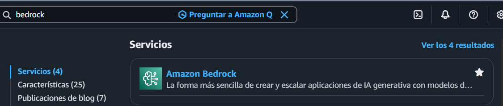

#### ¿Sabías que…?

**Amazon Bedrock** es un servicio administrado de AWS que permite desarrollar aplicaciones de inteligencia artificial generativa utilizando foundation models.

Amazon Bedrock puede utilizarse para tareas como:

- Generación de texto.
- Resúmenes.
- Clasificación.
- Análisis de información.
- Recuperación de conocimiento.
- Desarrollo de aplicaciones de IA generativa.

---

### Tarea 2. Acceder a Amazon Bedrock Flows

**Paso 1.** Dentro de Amazon Bedrock, ubicar el menú de navegación del lado izquierdo.

**Paso 2.** Desplazarse hacia abajo hasta localizar la sección **Compilación**.

**Paso 3.** Dentro de la sección **Compilación**, hacer clic en **Flujos**.

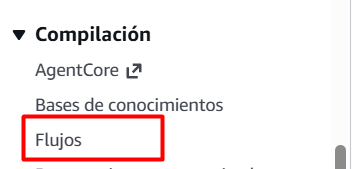

**Paso 4.** Esperar a que cargue la pantalla de administración de Amazon Bedrock Flows.

**Paso 5.** Localizar y seleccionar la opción **Crear flujo**.
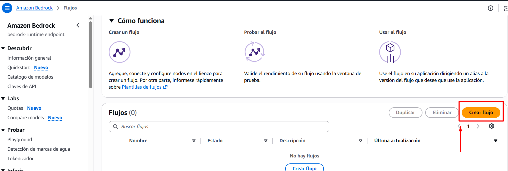

#### ¿Sabías que…?

**Amazon Bedrock Flows** permite diseñar workflows visuales mediante nodos y conexiones.

Estos flujos pueden incorporar componentes como:

- Entradas.
- Prompts.
- Foundation models.
- Agentes.
- Knowledge Bases.
- AWS Lambda.
- Lógica de control.
- Salidas.

Los workflows permiten controlar cómo se procesa y transfiere la información entre diferentes componentes de una aplicación de IA.

---

### Tarea 3. Crear un nuevo flujo

**Paso 1.** En el campo correspondiente al nombre del flujo, escribir:
```text
flujo-resumen-agentic-ai
```


**Paso 2.** En el campo de descripción, escribir:
```text
Flujo básico para explorar Amazon Bedrock Flows y procesar información mediante un foundation model.
```
**Paso 3.** Localizar la sección relacionada con el **rol de servicio**.

**Paso 4.** Seleccionar la opción para **crear y utilizar un nuevo rol de servicio**.

**Paso 5.** Mantener las demás configuraciones con sus valores predeterminados.

**Paso 6.** Hacer clic en **Crear**.

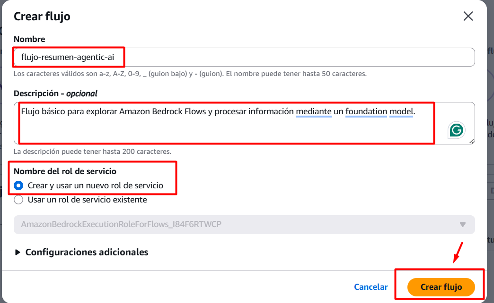

**Paso 7.** Esperar a que Amazon Bedrock cree el Flow y abra el Generador de flujos.

#### ¿Sabías que…?

Los servicios de AWS utilizan **IAM roles** para obtener permisos y acceder de forma controlada a otros recursos.

En esta práctica, el rol permite que Amazon Bedrock Flow utilice los recursos necesarios durante la ejecución del workflow.

---

### Tarea 4. Explorar el Generador de flujos

Después de crear el Flow, Amazon Bedrock mostrará automáticamente el **Generador de flujos**.

**Paso 1.** Localizar el nodo **Flow input**.

Este nodo representa la información inicial que recibe el workflow.

**Paso 2.** Localizar el nodo morado denominado **Prompt_1**.

Este nodo contiene las instrucciones que serán procesadas mediante un foundation model.

**Paso 3.** Localizar el nodo **Flow output**.

Este nodo representa el resultado final del proceso.

**Paso 4.** Observar las conexiones existentes entre los tres nodos.

**Paso 5.** Verificar que **Flow input** se encuentre conectado con **Prompt_1** y que **Prompt_1** se encuentre conectado con **Flow output**.

**Paso 6.** No modificar las conexiones existentes.

#### ¿Sabías que…?

Un **nodo** representa una actividad específica dentro de un workflow.

En este laboratorio:

- **Flow input** recibe la información.
- **Prompt_1** contiene las instrucciones que se enviarán al modelo.
- **Flow output** entrega el resultado.

Las conexiones permiten transferir información de un nodo al siguiente.

---

### Tarea 5. Configurar el foundation model

**Paso 1.** En el área central del Generador de flujos, localizar el nodo morado **Prompt_1**.

**Paso 2.** Hacer clic directamente sobre el nodo **Prompt_1**.

**Paso 3.** En el panel izquierdo, seleccionar la pestaña **Configurar**.
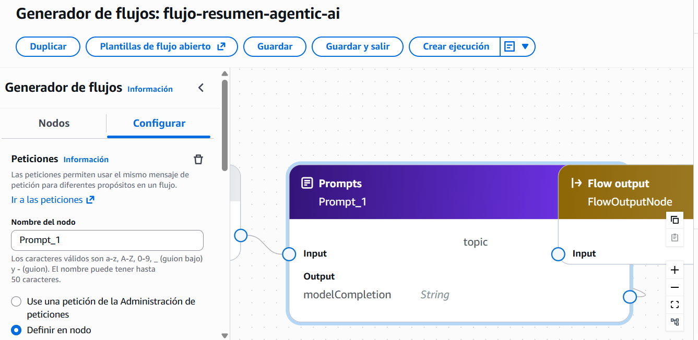

**Paso 4.** Verificar que se encuentre seleccionada la opción **Definir en nodo**.

**Paso 5.** Localizar la sección **Seleccionar el modelo** y hacer clic en la opción para elegir un modelo.
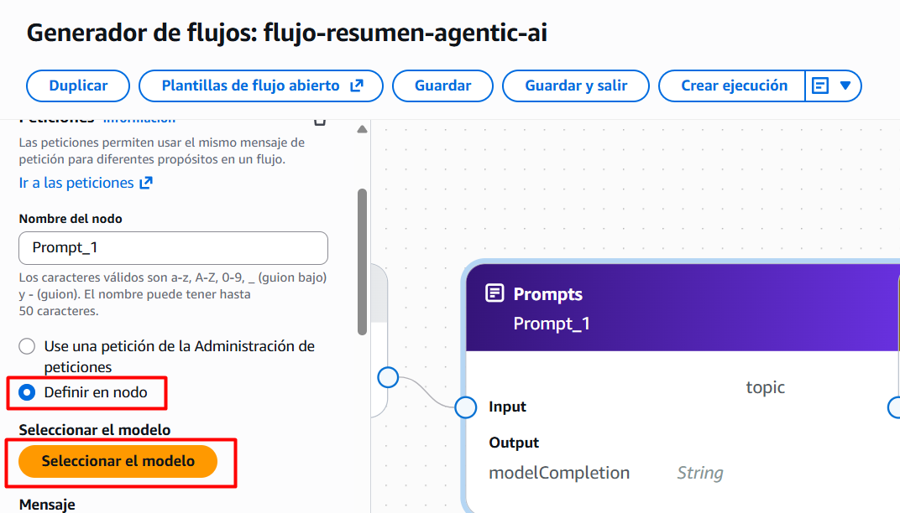
**Paso 6.** En la ventana **Seleccionar el modelo**, seleccionar **Amazon** dentro de la lista de proveedores.

**Paso 7.** Dentro de la lista de modelos disponibles, seleccionar:

`Nova Lite 1.0`

**Paso 8.** En la sección de inferencia, mantener seleccionada la opción:

`Bajo demanda`

**Paso 9.** Hacer clic en **Aplicar**.
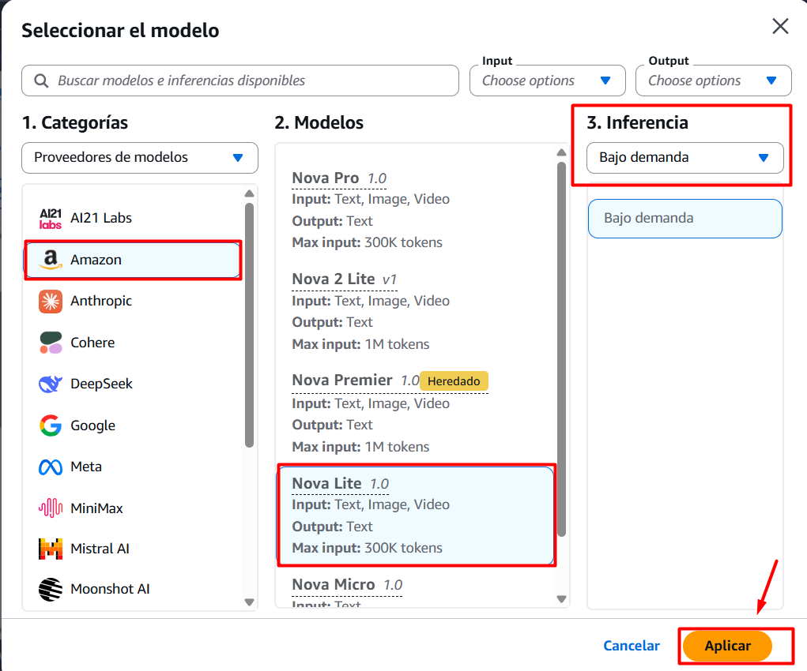

**Paso 10.** Verificar que en el panel de configuración aparezca **Nova Lite 1.0** y que la inferencia indique **Bajo demanda**.

**Paso 11.** Desplazarse hacia abajo dentro del panel de configuración hasta localizar el campo correspondiente al mensaje o instrucciones del prompt.

**Paso 12.** Escribir la siguiente instrucción:
```text
Resume el siguiente contenido de manera clara y concisa. Identifica las ideas principales y genera un resumen de máximo tres oraciones: {{document}}
```


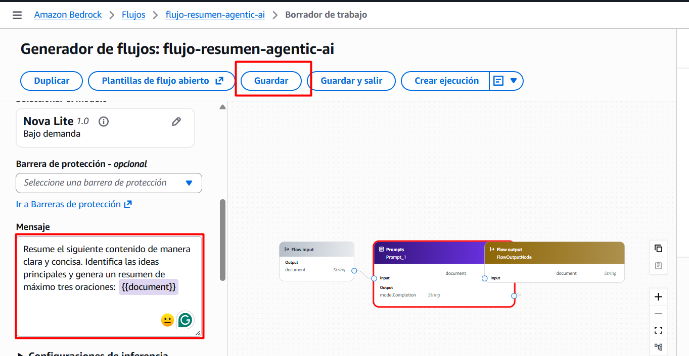

**Paso 13.** Verificar que el nodo **Flow input** permanezca conectado con **Prompt_1**.

**Paso 14.** Verificar que la salida **modelCompletion** de **Prompt_1** se encuentre conectada con **Flow output**.

**Paso 15.** No configurar una **Barrera de protección** para esta práctica.

**Paso 16.** Hacer clic en **Guardar**.

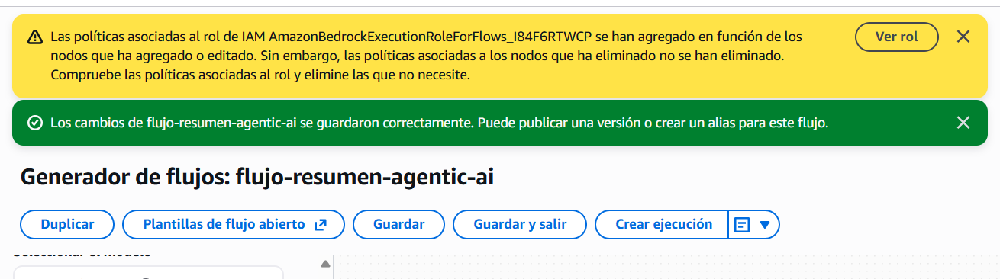

**Paso 17.** Verificar que aparezca un mensaje indicando que los cambios se guardaron correctamente.

> **Nota:** Es posible que Amazon Bedrock muestre una advertencia relacionada con las políticas asociadas al rol IAM creado para el Flow. Para esta práctica no es necesario modificar dichas políticas siempre que el Flow pueda guardarse y ejecutarse correctamente.

#### ¿Sabías que…?

En este laboratorio cada componente tiene una responsabilidad específica:

- **Flow input** recibe la información proporcionada por el usuario.
- **Prompt_1** incorpora las instrucciones que debe seguir el modelo.
- **Amazon Nova Lite 1.0** procesa la solicitud.
- **Flow output** devuelve la respuesta generada.

Este desacoplamiento entre entrada, instrucciones, modelo y salida facilita la creación de workflows reutilizables.

---

### Tarea 6. Probar el flujo

**Paso 1.** Localizar el panel **Probar flujo** ubicado en el lado derecho de la pantalla.

**Paso 2.** Hacer clic en el cuadro **Ingrese aquí el mensaje**.

**Paso 3.** Escribir el siguiente contenido:
```text
La inteligencia artificial agéntica permite crear sistemas capaces de interpretar objetivos, razonar, utilizar herramientas, tomar decisiones y ejecutar acciones con diferentes niveles de autonomía.
```

**Paso 4.** Verificar que el botón **Ejecutar** se encuentre habilitado.

**Paso 5.** Hacer clic en **Ejecutar**.

**Paso 6.** Esperar mientras Amazon Bedrock procesa la solicitud.

**Paso 7.** Revisar la respuesta generada en el panel de resultados.

**Paso 8.** Confirmar que el resultado presente un resumen relacionado con el contenido introducido.

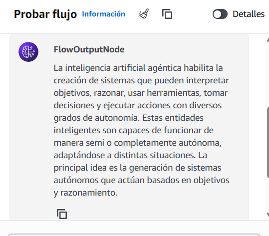

**Paso 9.** Identificar que el mensaje fue recibido por **Flow input**, procesado mediante **Prompt_1** y finalmente presentado a través de **Flow output**.

#### ¿Sabías que…?

Cuando se ejecuta el Flow, cada componente realiza una parte del proceso.

El nodo de entrada recibe la información, el nodo Prompt aplica las instrucciones y utiliza el foundation model, y finalmente el nodo de salida presenta el resultado.

Este enfoque permite organizar una aplicación de IA en pasos claramente definidos y controlados.

---

### Tarea 7. Ejecutar una segunda prueba

**Paso 1.** En el cuadro **Ingrese aquí el mensaje**, eliminar el contenido utilizado anteriormente.

**Paso 2.** Escribir:

```text
Amazon Bedrock AgentCore permite desarrollar, desplegar y gestionar agentes de inteligencia artificial de manera segura y escalable.
```

**Paso 3.** Hacer clic nuevamente en **Ejecutar**.

**Paso 4.** Esperar a que finalice el procesamiento.

**Paso 5.** Revisar la nueva respuesta generada.

**Paso 6.** Comparar el resultado obtenido con la primera ejecución.

**Paso 7.** Observar que no fue necesario modificar los nodos ni las conexiones del Flow.

**Paso 8.** Confirmar que el mismo workflow fue capaz de procesar una entrada diferente.

#### ¿Sabías que…?

Un mismo Flow puede reutilizarse para procesar múltiples entradas.

La arquitectura puede permanecer sin cambios, mientras que los resultados varían según:

- El contenido proporcionado.
- Las instrucciones del prompt.
- El foundation model utilizado.
- Los parámetros definidos para la ejecución.

Esta reutilización es importante en arquitecturas de IA, ya que permite separar la lógica del proceso de los datos que se procesan.

---

### Tarea 8. Revisar el rastro de la ejecución

**Paso 1.** Después de ejecutar el Flow, localizar la opción **Mostrar rastro** en el área donde aparece la respuesta.

**Paso 2.** Hacer clic en **Mostrar rastro**.
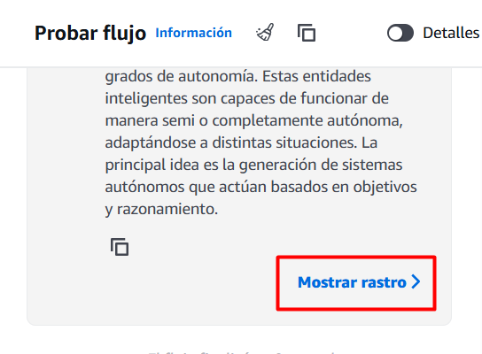

**Paso 3.** Observar los nodos que Amazon Bedrock muestra como parte de la ejecución.

Se deben identificar los siguientes elementos:

- **FlowInputNode (Input node)**
- **Prompt_1 (Prompt node)**
- **FlowOutputNode (Output node)**

**Paso 4.** Verificar que cada uno de los nodos muestre el estado **Completado**.

**Paso 5.** Observar el tiempo de ejecución mostrado junto a cada nodo.

**Paso 6.** Hacer clic en la flecha ubicada junto a **FlowInputNode** para visualizar sus detalles.

**Paso 7.** Revisar la información de entrada correspondiente al nodo.

**Paso 8.** Hacer clic en la flecha ubicada junto a **Prompt_1**.

**Paso 9.** Revisar la información relacionada con el procesamiento realizado por el foundation model.

**Paso 10.** Hacer clic en la flecha ubicada junto a **FlowOutputNode**.

**Paso 11.** Revisar el resultado final generado por el Flow.

**Paso 12.** Localizar el **ID de solicitud** que aparece en la parte superior del rastro.

**Paso 13.** Después de revisar la información, hacer clic en **Ocultar rastro**.

#### ¿Sabías que…?

El **trace o rastro** permite observar cómo se ejecutó una solicitud dentro del workflow.

Puede proporcionar información como:

- Nodos ejecutados.
- Orden de ejecución.
- Entrada de cada nodo.
- Salida de cada nodo.
- Estado.
- Tiempo de ejecución.
- Identificador de la solicitud.

Esta capacidad permite comprender el comportamiento interno de una aplicación y constituye una introducción práctica al concepto de **observabilidad**.

En soluciones de IA agéntica, la observabilidad cobra especial importancia porque los agentes pueden ejecutar múltiples pasos, utilizar herramientas y tomar diferentes decisiones antes de alcanzar un resultado.

---

### Tarea 9. Interpretar el resultado del Flow

**Paso 1.** Revisar nuevamente la respuesta presentada por **FlowOutputNode**.

**Paso 2.** Confirmar que el contenido generado corresponda con el mensaje utilizado durante la segunda prueba.

**Paso 3.** Identificar la función de cada componente:

- **FlowInputNode** recibió el mensaje.
- **Prompt_1** aplicó las instrucciones configuradas.
- **Amazon Nova Lite 1.0** procesó la solicitud.
- **FlowOutputNode** presentó el resultado.

**Paso 4.** Confirmar que los tres nodos aparezcan con estado **Completado** dentro del rastro.

**Paso 5.** Comparar los tiempos de ejecución mostrados para cada nodo.

**Paso 6.** Observar que normalmente **Prompt_1** utiliza más tiempo que los nodos de entrada y salida, ya que durante esta etapa se realiza la inferencia mediante el foundation model.

#### ¿Sabías que…?

El tiempo total de un workflow depende de las operaciones realizadas por sus diferentes componentes.

Las operaciones de entrada y salida generalmente requieren poco procesamiento, mientras que una llamada a un foundation model puede necesitar más tiempo debido a la inferencia de inteligencia artificial.

En soluciones agénticas más avanzadas pueden existir varias llamadas a modelos, herramientas o fuentes de información, por lo que analizar estos tiempos resulta importante para comprender el rendimiento de la solución.

---

### Tarea 10. Eliminar el recurso

**Paso 1.** Después de finalizar las pruebas, hacer clic en **Guardar y salir**.

**Paso 2.** Dentro de Amazon Bedrock, ubicar nuevamente el menú de navegación del lado izquierdo.

**Paso 3.** Desplazarse hasta localizar la sección **Compilación**.

**Paso 4.** Dentro de esta sección, seleccionar **Flujos**.

**Paso 5.** En la lista de flujos disponibles, localizar:

`flujo-resumen-agentic-ai`

**Paso 6.** Seleccionar el Flow.

**Paso 7.** Hacer clic en **Eliminar**.

**Paso 8.** Confirmar la eliminación cuando la consola lo solicite.

> **Nota:** Si se utiliza una cuenta temporal de laboratorio que elimina automáticamente los recursos, esta tarea puede omitirse siguiendo las instrucciones proporcionadas por el instructor.

#### ¿Sabías que…?

Eliminar los recursos que ya no se necesitan es una buena práctica de administración en AWS.

Esto permite:

- Mantener organizado el entorno.
- Reducir recursos innecesarios.
- Evitar posibles costos posteriores.
- Facilitar la administración del ambiente de laboratorio.

---

## Resultado esperado

Al finalizar el laboratorio, el participante habrá creado, configurado y probado correctamente un workflow utilizando **Amazon Bedrock Flows** y **Amazon Nova Lite 1.0**.

El participante deberá haber logrado:

- Crear un Amazon Bedrock Flow.
- Identificar **FlowInputNode**, **Prompt_1** y **FlowOutputNode**.
- Configurar **Amazon Nova Lite 1.0** como foundation model.
- Ejecutar al menos dos pruebas utilizando diferentes entradas.
- Obtener una respuesta generada mediante el Flow.
- Utilizar **Mostrar rastro** para observar los nodos involucrados.
- Verificar que los nodos presenten el estado **Completado**.
- Identificar el tiempo de ejecución de cada nodo.
- Reconocer la relación entre workflows, orquestación y futuras soluciones de IA agéntica.

---

## Conclusiones

En este laboratorio el participante obtuvo una primera experiencia práctica con **Amazon Bedrock Flows**, creando, configurando y ejecutando un workflow sencillo de inteligencia artificial generativa.

Puntos clave aprendidos:

- **Amazon Bedrock Flows** permite construir workflows mediante nodos y conexiones.
- **Flow input** recibe la información inicial.
- **Prompt_1** contiene las instrucciones que se aplicarán a la entrada.
- **Amazon Nova Lite 1.0** proporciona la capacidad de generación utilizada durante la práctica.
- **Flow output** entrega el resultado final.
- Un mismo Flow puede procesar diferentes entradas sin modificar su arquitectura.
- La opción **Mostrar rastro** permite visualizar el recorrido realizado por una solicitud.
- Cada nodo permite identificar su estado y tiempo de ejecución.
- El **trace** facilita la comprensión del comportamiento interno de un workflow.
- Los workflows permiten organizar y coordinar componentes de IA de manera estructurada.
- Este tipo de orquestación constituye una base importante para comprender arquitecturas de **IA agéntica** más avanzadas.

En una solución agéntica, estos conceptos pueden ampliarse mediante capacidades como **razonamiento, planificación, memoria, herramientas, toma de decisiones y adaptación**, permitiendo que un agente determine dinámicamente cómo avanzar hacia un objetivo.

El laboratorio proporciona una transición práctica entre los **patrones de workflow** estudiados en el curso y las soluciones de **Agentic AI** que se abordan posteriormente.

---

## Fin del demostracion 1
