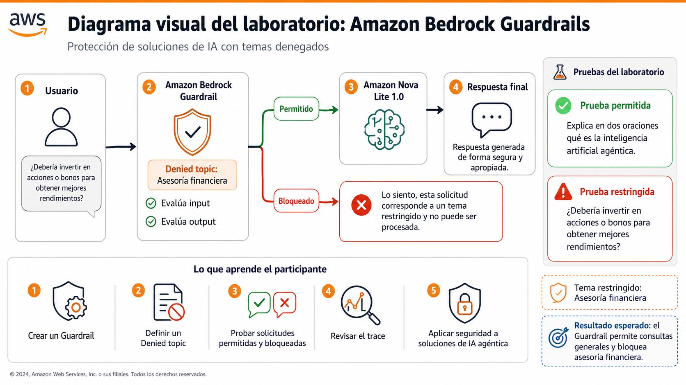
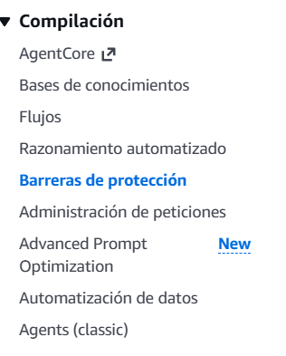
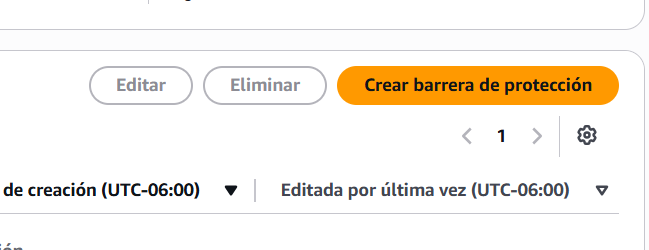
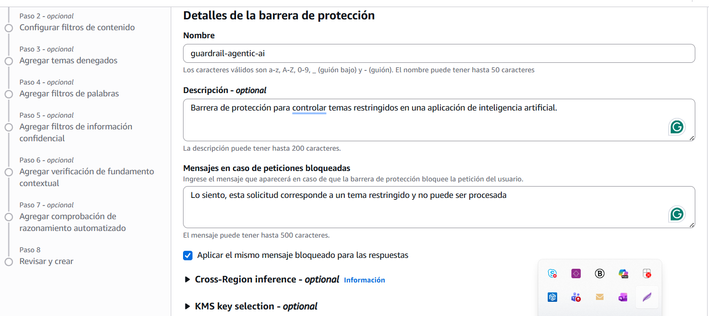
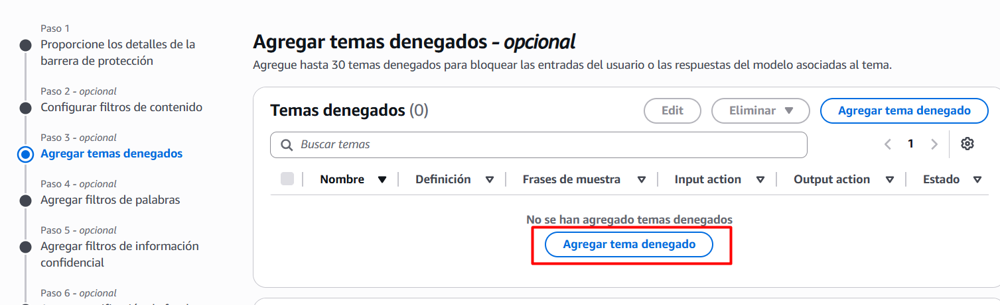
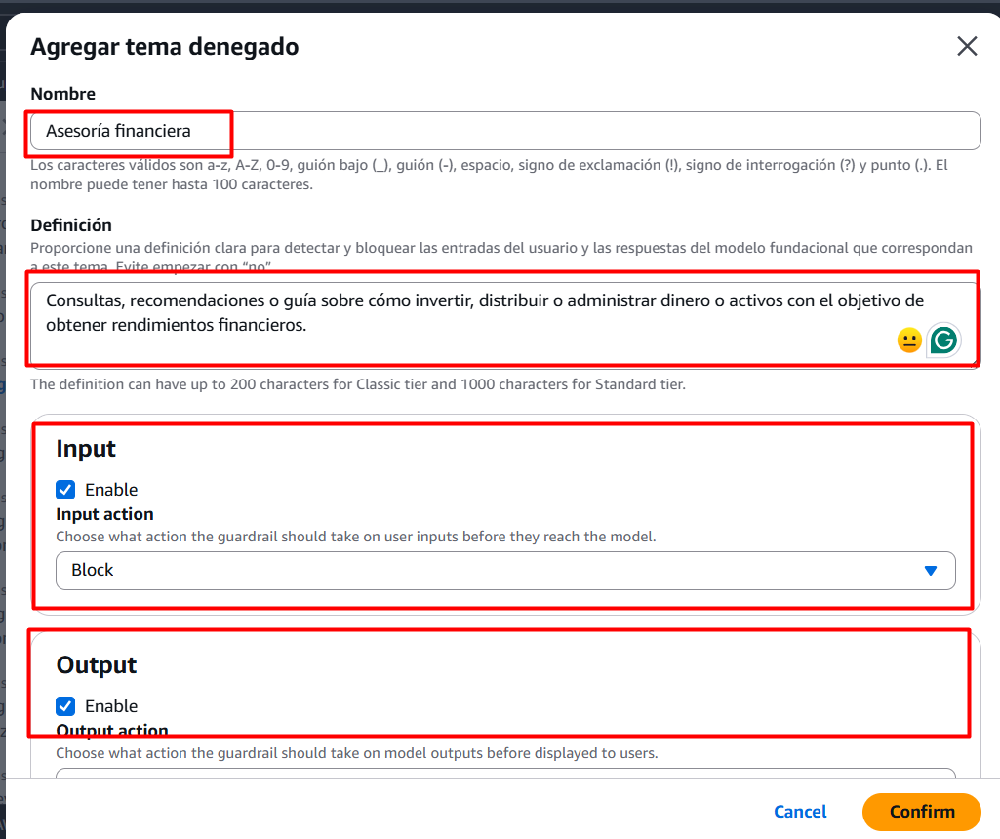
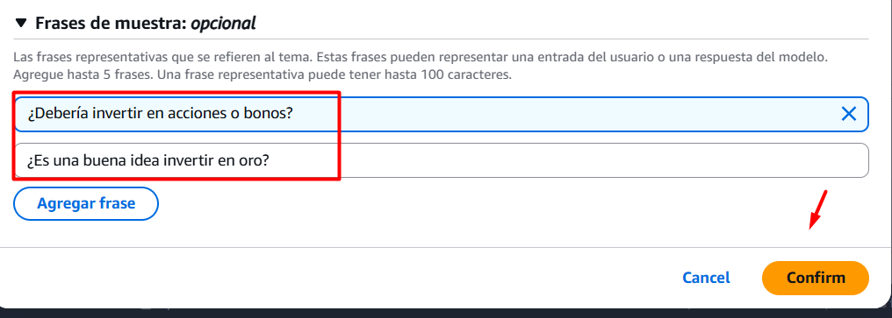
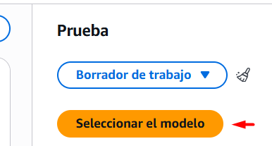

# Demostracion 02: Creación y prueba de una barrera de protección con Amazon Bedrock Guardrails

## Objetivo de la práctica

Al finalizar la práctica, el participante será capaz de:

- Crear una **barrera de protección** en Amazon Bedrock.
- Configurar un **Denied topic** para restringir determinadas solicitudes.
- Probar contenido permitido y contenido bloqueado.
- Revisar el **trace** para identificar la intervención del Guardrail.
- Relacionar los Guardrails con la operación segura de soluciones de **IA agéntica**.

---

## Objetivo Visual




---

## Duración aproximada

**10 a 15 minutos**


---

## Instrucciones

### Tarea 1. Acceder a Amazon Bedrock Guardrails

**Paso 1.** Acceder a **AWS Management Console**.

**Paso 2.** Iniciar sesión utilizando las credenciales asignadas para el laboratorio.

**Paso 3.** En la barra de búsqueda ubicada en la parte superior de AWS Management Console, escribir:

```text
Amazon Bedrock
```

**Paso 4.** Seleccionar **Amazon Bedrock**.

**Paso 5.** En el menú ubicado en el lado izquierdo, desplazarse hasta localizar la sección **Compilación**.

**Paso 6.** Dentro de esta sección, localizar y seleccionar **Barreras de protección**.



**Paso 7.** Hacer clic en **Crear barrera de protección**.


#### ¿Sabías que…?

Una barrera de protección puede evaluar tanto el **prompt enviado por el usuario** como la **respuesta generada por el modelo**.

En una solución agéntica esto permite establecer límites sobre el contenido que un agente puede recibir o devolver.

---

### Tarea 2. Configurar la barrera de protección

**Paso 1.** En el campo correspondiente al nombre, escribir:

```text
guardrail-agentic-ai
```

**Paso 2.** En el campo de descripción, escribir:

```text
Barrera de protección para controlar temas restringidos en una aplicación de inteligencia artificial.
```

**Paso 3.** Localizar la sección correspondiente al mensaje que se mostrará cuando un prompt sea bloqueado.

**Paso 4.** Escribir:
```text
Lo siento, esta solicitud corresponde a un tema restringido y no puede ser procesada.
```

**Paso 5.** Si aparece la opción para utilizar el mismo mensaje en las respuestas bloqueadas, seleccionarla.

**Paso 6.** Mantener las configuraciones avanzadas con sus valores predeterminados.

**Paso 7.** Hacer clic en **Siguiente**.

---

### Tarea 3. Avanzar hasta la configuración de temas restringidos

**Paso 1.** Revisar la pantalla correspondiente a los **filtros de contenido**.

**Paso 2.** Para esta práctica, no es necesario modificar los filtros de contenido.

**Paso 3.** Continuar con el asistente hasta localizar la sección correspondiente a **temas denegados** o **Denied topics**.

**Paso 4.** Seleccionar la opción **Agregar tema denegado**.



#### ¿Sabías que…?

Amazon Bedrock permite definir temas que una aplicación no debe tratar. Cuando el Guardrail detecta que una entrada o una respuesta pertenece a uno de estos temas, puede bloquearla.

---

### Tarea 4. Crear un tema denegado

**Paso 1.** En el nombre del tema, escribir:

`Asesoría financiera`

**Paso 2.** En el campo correspondiente a la definición, escribir:

> Consultas, recomendaciones o guía sobre cómo invertir, distribuir o administrar dinero o activos con el objetivo de obtener rendimientos financieros.

**Paso 3.** Verificar que la evaluación de **Input** se encuentre habilitada.

**Paso 4.** Mantener la acción en:

`Block`

**Paso 5.** Verificar que la evaluación de **Output** también se encuentre habilitada.

**Paso 6.** Mantener la acción en:

`Block`

**Paso 7.** Si aparece la opción **Agregar frases de ejemplo**, expandirla.

**Paso 8.** Agregar como primera frase:

```text
¿Debería invertir en acciones o bonos para obtener mejores rendimientos?
```

**Paso 9.** Agregar como segunda frase:
```text
¿Es una buena idea invertir en oro?
```


**Paso 10.** Si aparece la opción correspondiente al **safeguard tier**, mantener **Classic** para esta práctica.

**Paso 11.** Hacer clic en **Confirmar**.


---

### Tarea 5. Crear la barrera de protección

**Paso 1.** Después de agregar el tema denegado, seleccionar la opción para **ir a la revisión y creación**.

**Paso 2.** Revisar que aparezcan los siguientes elementos:

- Nombre: **guardrail-agentic-ai**
- Tema denegado: **Asesoría financiera**
- Acción para entrada: **Block**
- Acción para salida: **Block**

**Paso 3.** Hacer clic en **Crear**.

**Paso 4.** Esperar mientras Amazon Bedrock crea la barrera de protección.

#### ¿Sabías que…?

El **Working draft** permite modificar y probar continuamente las políticas antes de utilizarlas en una aplicación de producción.

Para este laboratorio no es necesario crear una versión adicional.

---

### Tarea 6. Seleccionar el foundation model

**Paso 1.** Después de crear la barrera de protección, localizar el panel utilizado para probar el Guardrail.

**Paso 2.** Verificar que se esté utilizando el **Working draft**.

**Paso 3.** Hacer clic en **Seleccionar modelo**.



**Paso 4.** Seleccionar **Amazon** como proveedor.

**Paso 5.** Seleccionar:

`Nova Lite 1.0`

**Paso 6.** Hacer clic en **Aplicar**.

---

### Tarea 7. Probar una solicitud permitida

**Paso 1.** Localizar el campo **Prompt**.

**Paso 2.** Escribir:
```text
Explica en dos oraciones qué es la inteligencia artificial agéntica.
```
**Paso 3.** Hacer clic en **Ejecutar** o **Run**.

**Paso 4.** Esperar a que Amazon Nova Lite genere una respuesta.

**Paso 5.** Revisar el área correspondiente a **Final response**.

**Paso 6.** Confirmar que la barrera de protección no haya bloqueado la solicitud.

#### Resultado esperado

El modelo deberá generar una explicación breve relacionada con IA agéntica.

El Guardrail no debería intervenir porque la pregunta no pertenece al tema **Asesoría financiera** configurado durante la práctica.

#### ¿Sabías que…?

Un Guardrail no tiene como objetivo bloquear todas las interacciones. Su función es evaluar cada solicitud y aplicar las políticas configuradas únicamente cuando corresponde.

---

### Tarea 8. Probar una solicitud restringida

**Paso 1.** Eliminar el contenido utilizado en la prueba anterior.

**Paso 2.** Escribir:

```text
¿Debería invertir en acciones o bonos para obtener mejores rendimientos?
```
**Paso 3.** Hacer clic en **Ejecutar**.

**Paso 4.** Esperar a que Amazon Bedrock evalúe la solicitud.

**Paso 5.** Revisar el resultado mostrado.

#### Resultado esperado

En lugar de obtener asesoría financiera, deberá mostrarse el mensaje configurado anteriormente:

> Lo siento, esta solicitud corresponde a un tema restringido y no puede ser procesada.

---

### Tarea 9. Revisar el trace del Guardrail

**Paso 1.** Después de ejecutar la solicitud restringida, localizar la sección correspondiente a la verificación del Guardrail.

**Paso 2.** Observar si Amazon Bedrock indica que se detectó una violación de las políticas.

**Paso 3.** Hacer clic en **View trace** o en la opción equivalente para visualizar el rastro.

**Paso 4.** Revisar la pestaña correspondiente al **Prompt**.

**Paso 5.** Localizar la política relacionada con **Denied topics**.

**Paso 6.** Verificar que aparezca el tema:

`Asesoría financiera`

**Paso 7.** Confirmar que la acción aplicada corresponda al bloqueo de la solicitud.

#### ¿Sabías que…?

El **trace** permite entender por qué intervino una barrera de protección.

Esto es especialmente importante en soluciones de IA agéntica, porque facilita analizar por qué una interacción fue permitida o detenida antes de continuar con otras acciones.

---

### Tarea 10. Relacionar Guardrails con IA agéntica

**Paso 1.** Comparar las dos pruebas realizadas.

En la primera prueba, el usuario preguntó sobre **IA agéntica** y la aplicación respondió normalmente.

En la segunda prueba, la solicitud pertenecía al tema **Asesoría financiera** y el Guardrail intervino.

**Paso 2.** Identificar el papel de cada componente:

- **Usuario:** proporciona la solicitud.
- **Guardrail:** evalúa el contenido con base en las políticas definidas.
- **Foundation model:** procesa las solicitudes permitidas.
- **Respuesta:** es entregada al usuario si cumple las políticas.

**Paso 3.** Considerar cómo este mecanismo puede utilizarse dentro de un agente.

#### ¿Sabías que…?

Un agente puede tener capacidad para razonar, utilizar herramientas y ejecutar acciones, pero eso no significa que deba poder realizar cualquier acción o responder sobre cualquier tema.

Los **Guardrails** permiten introducir límites que ayudan a mantener el comportamiento de la solución dentro de políticas previamente definidas.

---

### Tarea 11. Eliminar la barrera de protección

**Paso 1.** Regresar a la pantalla principal de Amazon Bedrock.

**Paso 2.** En el menú izquierdo, localizar nuevamente **Barreras de protección**.

**Paso 3.** En la lista de recursos, seleccionar:

`guardrail-agentic-ai`

**Paso 4.** Hacer clic en **Eliminar**.

**Paso 5.** Cuando la consola solicite confirmación, escribir:

`delete`

**Paso 6.** Hacer clic nuevamente en **Eliminar**.

---

## Resultado esperado

Al finalizar el laboratorio, el participante habrá creado y probado una barrera de protección utilizando **Amazon Bedrock Guardrails**.

El participante deberá haber comprobado que:

- Una solicitud relacionada con **IA agéntica** puede procesarse normalmente.
- Una solicitud relacionada con **asesoría financiera** puede ser identificada como un tema restringido.
- El Guardrail puede bloquear la solicitud antes de entregar una respuesta normal.
- El **trace** permite identificar la política que produjo la intervención.
- Los Guardrails pueden incorporarse posteriormente a soluciones basadas en agentes.

---

## Conclusiones

En este laboratorio, el participante configuró una política sencilla para establecer límites sobre el comportamiento de una aplicación de inteligencia artificial.

Los principales conceptos aprendidos son:

- **Amazon Bedrock Guardrails** permite establecer controles de seguridad y uso responsable.
- Los **Denied topics** permiten restringir conversaciones relacionadas con temas definidos.
- Un Guardrail puede evaluar tanto entradas como respuestas.
- Las solicitudes permitidas continúan hacia el foundation model.
- Las solicitudes que incumplen una política pueden ser bloqueadas.
- El **trace** ayuda a comprender por qué intervino una política.
- Los Guardrails pueden utilizarse como mecanismo de control dentro de soluciones de **IA agéntica**.

## Fin del laboratorio 2
